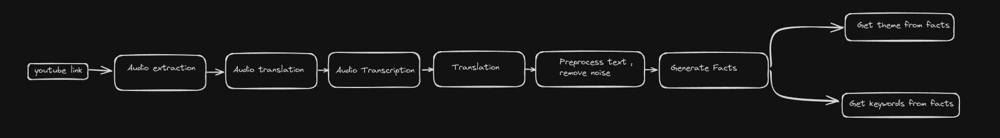

# YouTube Knowledge Extraction Pipeline 

 ## Overview 

This pipeline transforms YouTube video content into structured, searchable knowledge. It benefits content creators, researchers, and educational technologists. 

## Process Flow 

  

1. **YouTube Link**: Start with a video URL. 

2. **Audio Extraction**: Use `yt-dlp` to isolate audio. 

3. **Audio Transcription**: Convert audio to text with Whisper. 

4. **Translation**: Translate non-English text using Azure Speech Technology. 

5. **Preprocess Text**: Clean text with GPT-4. 

6. **Generate Facts**: Extract facts with GPT-4. 

7. **Get Theme**: Identify central theme with GPT-4. 

8. **Get Keywords**: Extract key terms for indexing with GPT-4. 

## Setup 

### Prerequisites 

- Python 3+ ([Download](https://www.python.org/)) 

### Installation 

1. Clone the repository and navigate to the directory: 

   ```bash 

   git clone https://github.com/kissanai/youtube-kb-pipeline.git 

   cd youtube-kb-pipeline 

   ``` 

2. Create and activate a virtual environment: 

   - **Linux/Mac**: 

     ```bash 

     python3 -m venv venv 

     source venv/bin/activate 

     ``` 

   - **Windows**: 

  

     ```bash 

     python -m venv venv 

     .\venv\Scripts\activate 

     ``` 

3. Install dependencies: 

   ```bash 

   pip install -r requirements.txt 

   ``` 

4. To deactivate the virtual environment: 

   ```bash 

   deactivate 

   ``` 

## Usage 

1. **Sequential Processing**: Use `main.py` for single video processing. 

2. **Parallel Processing**: Use `main_parallel.py` for batch processing. 

### Execution 

- Add YouTube video links to `data/input_data/video_links_list.csv`. 

- Execute the script: 

  - **Sequential**: `python main.py` 

  - **Parallel**: `python main_parallel.py` 

## Technical Details 

- **Parallel Processing**: Employs `multiprocessing` for efficiency. 

- **Output**: Results in Excel format (`data/output_data/video_links_list_results.xlsx`). 

  

## File Structure 

- **audio_extraction/**: Scripts for audio extraction. 

- **data_extraction/**: Scripts for generating facts, themes, and keywords. 

- **preprocessing_text/**: Scripts for text cleaning. 

- **transcription/**: Scripts for audio transcription and language detection. 

- **translation/**: Scripts for text translation. 

- **input_data/**: Input folder for YouTube links. 

- **output_data/**: Folder for pipeline results. 

- **utils/**: Auxiliary utilities.

- **utils/clean_up_data.py**: Script to clean up data from previous run .

- **utils/error.py**: Error classes .

- **main.py**: Script for sequential processing. 

- **main_parallel.py**: Script for parallel processing. 

- **clean_up_data.py**: Script for deleting data from previous run.

- **requirements.txt**: List of dependencies. 


## Note 

1)Ensure you have the correct API keys and permissions for yt-dlp, Whisper, Azure, and GPT-4. 

2)Ensure to change model name to name used for model while deployment if Azure OpenAI is utilized. 