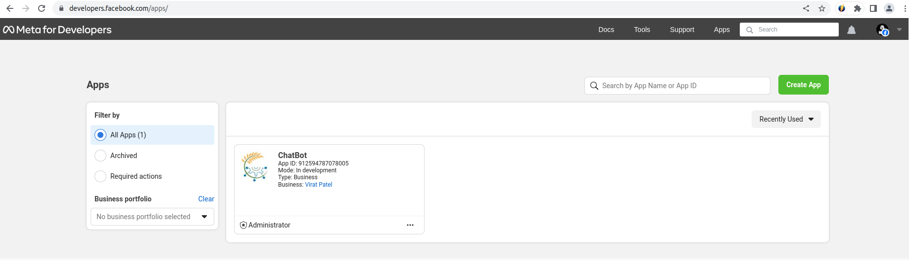
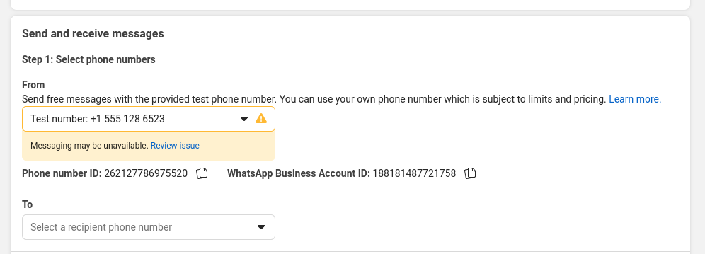

# WhatsApp Setup Guide

This guide walks you through setting up your WhatsApp API integration with a Facebook Developer account.

## Developer Facebook Account Setup

1. **Create or Access Your App:**
   - Go to the [Facebook Developer Apps](https://developers.facebook.com/apps/) page.
   - If you don't have an app, create one.
   - Click on your app name to access the dashboard.
   

2. **Configure Webhooks:**
   - Navigate to Webhooks in the left sidebar.
   - Subscribe to the messages API.
   
   - Configure your webhook URL and verification token.

3. **WhatsApp API Setup:**
   - Go to WhatsApp -> API Setup.
   - Get your temporary access token (valid for 24 hours).
   
   - Copy the token to your `.env` file:
     ```
     WHATSAPP_API_TOKEN = 'your_token'
     ```

4. **Phone Number Configuration:**
   - Find your Phone number ID and copy it to `.env`:
     ```
     WHATSAPP_NUMBER_ID = '262127786975520'
     ```
   
   - To add a new phone number:
     1. Go to "Manage phone number list".
     
     2. Click "Add phone number".
     
     3. Follow the verification process with OTP.
     
     4. Once verified, the number will appear in your "To" section.
     

5. **Testing Your Setup:**
   - You can send a test message using the interface.
   
   - You should receive a default template message on your WhatsApp number.
   

6. **Final Configuration:**
   - Go to the Configuration section.
   
   - Set your backend webhook URL.
   - Enter your verification token (same as WHATSAPP_HOOK_TOKEN in .env):
     ```
     WHATSAPP_HOOK_TOKEN = 'your_verification_token'
     ```
   
   - Click "Verify and Save".

## Important URLs and Settings

- **API Base URL (for whatsapp_wrapper.py):**
  ```python
  self.base_url = "https://graph.facebook.com/v18.0/"
  ```

- **Webhook URL format:**
  ```
  https://[backend-url]/webhook/
  ```

- **Verification Token example:**
  ```
  WHATSAPP_HOOK_TOKEN = 'your_verification_token'
  ```

Once your token is verified, your webhook connection will be established and ready to use.